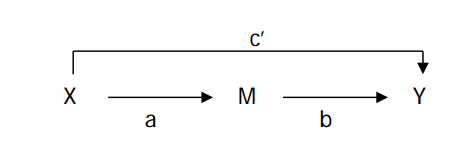

Treatment Variable | Mediation variable | Response Variable
-------------------|--------------------|---------------------
      X            |          M         |          Y
    Jim Crow       |   Gini Coeficient  | Socail Captial index

***

# 1. Preprocessing 

```{r message=FALSE}
library("xlsx") 
library(dplyr)
library(Amelia)
library(ggplot2)
library("mediation")
library(dplyr)
library(psych)
library(plm)
```
### 1.1 load and merge
```{r}

# load the data
table_1997<-read.xlsx("../data/social capital 1997-2014.xlsx", 1)
table_2005<-read.xlsx("../data/social capital 1997-2014.xlsx", 2)
table_2009<-read.xlsx("../data/social capital 1997-2014.xlsx", 3)
table_2014<-read.xlsx("../data/social capital 1997-2014.xlsx", 4)
# change the header so we could align dataframe
names(table_2014)<-c("fips","areaname","sk14")

m.1<-table_1997 %>% 
  full_join(table_2005, by = c("fips","areaname")) %>%
  dplyr::select(everything())

m.2<-table_2009 %>% 
  full_join(table_2014, by = c("fips")) %>%
  dplyr::select(fips,sk09,sk14)

merged<-m.1 %>%
  full_join(m.2, by = c("fips"))%>%
  dplyr::select(everything())

all_content = readLines("../data/Gini coefficient 2010-2014.csv")
skip_second = all_content[-2]
Gini_coe    = read.csv(textConnection(skip_second), header = TRUE, stringsAsFactors = FALSE)

names(merged)[1]<-c("GEO.id2")
merged<-merged %>%  
  full_join(Gini_coe, by = c("GEO.id2")) %>%
  dplyr::select(GEO.id2, sk97, sk05, sk09, sk14,GEO.display.label,HD01_VD01)
summary(merged)
```

### 1.2 treat missing data
```{r}
missmap(merged)
merged<-na.omit(merged) # remove NA
```


Since the missing values only account for a small proportion of the dataset. And it is not correlated with Y (dependent) and X variables (independent) We could safely delete them.  

### 1.3 Jim_crow as independent variable
```{r}

n_row   <-nrow(merged)
list_1  <-strsplit(merged$GEO.display.label,split=",")
State.County      <-data.frame(matrix(unlist(list_1),nrow=n_row,byrow=T))
colnames(State.County)<-c("County","State")
merged<-cbind(merged,State.County)

merged$State<-as.character(merged$State)
merged$State<-substr(merged$State,2,nchar(merged$State))
# add new independent variable 
Jim_Crow_States_list<-unlist(strsplit(" Alabama, Arizona, Arkansas, Delaware, Florida, Georgia, Kansas, Kentucky, Louisiana, Maryland, Mississippi, Missouri, New Mexico, North Carolina, Oklahoma, South Carolina, Tennessee, Texas, Virginia, West Virginia, Wyoming",","))
Jim_Crow_States_list<-substr(Jim_Crow_States_list,2,nchar(Jim_Crow_States_list))
Jim_Crow_States_list

```


```{r}
# add dummy variables  Jim_Crow
"Alabama" %in% Jim_Crow_States_list
merged$Jim_Crow<-(merged$State  %in% Jim_Crow_States_list)
```


# 2 Structural Mediation Regression analysis
## 2.1 Step 1 Regression M ---> Y
Gini coefficient 2010-2014 --> on Social Capital 2014 (Social Capital is dependent variable)
```{r}
names(merged)[7]<-"Gini_Coefficient"
ggplot(data = merged)+
  geom_smooth(aes(x=Gini_Coefficient,y=sk14))+ geom_point(aes(x=Gini_Coefficient,y=sk14))+
  labs(title="Scatter plot of Gini Coefficient and Social Capital Index")

```
```{r}
cat("the maximum value for social capital is ",merged$GEO.display.label[which.max(merged$sk14)])
cat("\nThis value is around the center of the data. In statistics, it wouldn't affect the model estimate very much. It was not a influential point.")
```


```{r}
m1<-lm(sk14~Gini_Coefficient,data=merged)
summary(m1)
```


## 2.2 step2 X(jim_crow)---->M(Gini_Coefficient) 
States with Jim Crow Law are = 1, states without Jim Crow Laws are = 0.
```{r}
ggplot(data =merged)+
  geom_boxplot(aes(x=Jim_Crow,y=Gini_Coefficient))+ 
  labs(title="Boxplot of Jim_Crow and Gini_Coe ")
```

```{r}
ggplot(data=merged,aes(x=Gini_Coefficient,color=Jim_Crow))+
  geom_density()+
  labs(title="Gini Coefficient Density by Jim_Crow")
  
```

```{r}
cat("summary statistics of gini coefficient by group")
describeBy(merged$Gini_Coefficient,list(jim_crow=merged$Jim_Crow))
```


Simple Linear Regression Model
Jim Crow Laws --> on Gini coefficient 2010-2014
```{r}
med.fit<-lm(Gini_Coefficient~Jim_Crow,data=merged)
summary(med.fit)
```


## 2.3 step3 X---->Y
4. Regression
Jim Crow Laws --> social capital 1997, 2005, 2009, 2014 (do for each year separately)


#### year 1997
```{r}
summary(lm(sk97~Jim_Crow,data=merged))
```


```{r}
cat("summary statistics of 1997 social capital index by group")
describeBy(merged$sk97,list(jim_crow=merged$Jim_Crow))
```

```{r}
ggplot(data=merged,aes(x=sk97,color=Jim_Crow))+
  geom_density()+
  labs(title="Social Capital Density by Jim_Crow")
  
```


#### year 2005
```{r}
summary(lm(sk05~Jim_Crow,data=merged))
```
```{r}
ggplot(data=merged,aes(x=sk05,color=Jim_Crow))+
  geom_density()+
  labs(title="2005 County Level Social Capital Density by Jim_Crow")+
  xlim(-5, 10)
```
```{r}
cat("summary statistics of 2005 social capital index by group")
describeBy(merged$sk05,list(jim_crow=merged$Jim_Crow))
```
#### year 2009
```{r}
summary(lm(sk09~Jim_Crow,data=merged))

```
```{r}
ggplot(data=merged,aes(x=sk09,color=Jim_Crow))+
  geom_density()+
  labs(title="2009 County Level Social Capital Density by Jim_Crow")+
  xlim(-5, 10)
```
```{r}
cat("summary statistics of 2009 social capital index by group")
describeBy(merged$sk09,list(jim_crow=merged$Jim_Crow))
```


#### year 2014
```{r}
summary(lm(sk14~Jim_Crow,data=merged))
```

```{r}
ggplot(data=merged,aes(x=sk14,color=Jim_Crow))+
  geom_density()+
  labs(title="2014 County Level Social Capital Density by Jim_Crow")+
  xlim(-5, 10)
```


```{r}
cat("summary statistics of 2014 social capital index by group")
describeBy(merged$sk14,list(jim_crow=merged$Jim_Crow))
```


## step 4 all together 
5. Regression
Jim Crow Laws + Gini Coefficient --> Social Capital (2014)
```{r}
out.fit<-lm(sk14~Jim_Crow+Gini_Coefficient,data=merged)
summary(out.fit)
```
```{r}

write.csv(merged,"../output/merged.csv",row.names = FALSE)
```


